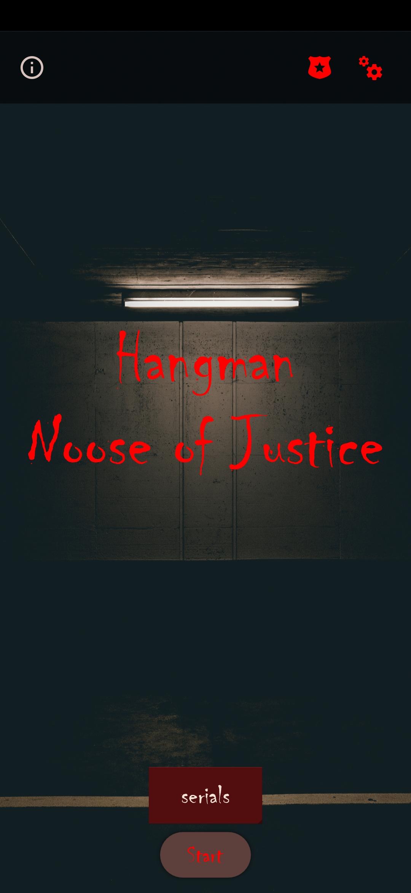
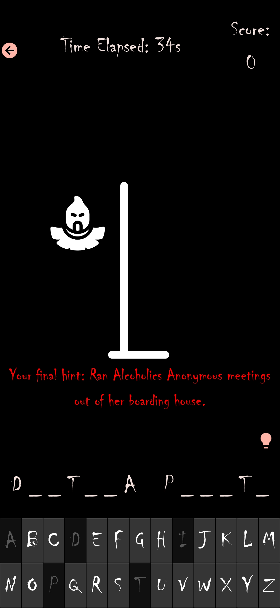
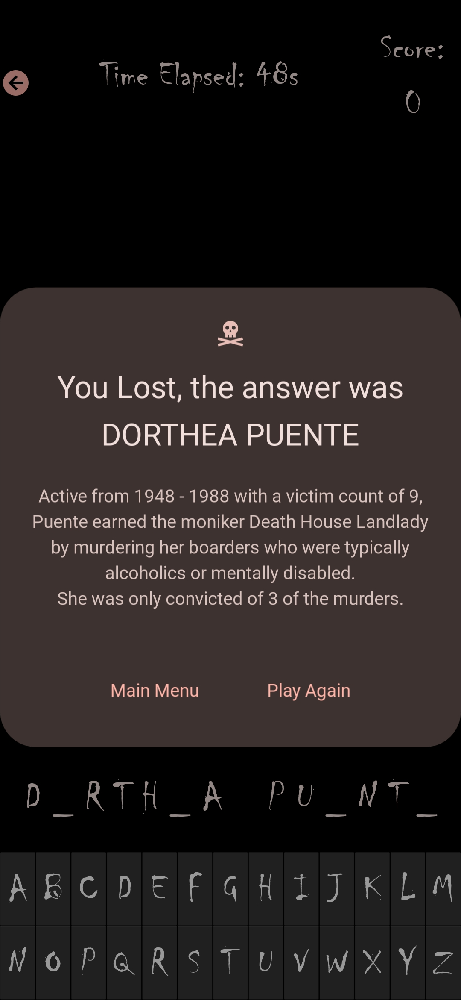

# 🔪 Hangman: Noose of Justice

**A true crime twist on the classic word game.**  
Uncover the names of real-life criminals, learn their dark stories, and test your knowledge of infamous cases in this hangman game.

---

## 🕹️ Features

- 🧠 **Real Crime-Based Gameplay** – Guess the names of serial killers, cult leaders, and unsolved cases.
- 🗂️ **Multiple Categories** – Including *Female Murderers*, *Serials*, *Cold Cases*, and more.
- 📜 **Mini Case Files** – Every puzzle reveals details from real criminal history.
- 🚫 **No Ads. No Distractions. Just Justice.**

---

## 📸 Screenshots

| Menu | Gameplay | Case Reveal |
|------|----------|-------------|
|  |  |  |

> 💡 Want a feel for the gameplay? [Check out the trailer here.](#)

---

## 📦 Installation

**Android (Play Store):**  
[▶ Download on Google Play](https://play.google.com/store/apps/details?id=com.yourpackage.nooseofjustice](https://play.google.com/store/apps/details?id=hangman.game.hangman)

OR

[Download for Windows from Itch.io](https://eloliver.itch.io/hangman-noose-of-justice)

---

## 🙌 Contributing
Pull requests welcome!

Feel free to suggest new case categories, difficulty modes, or localization ideas.

If you like the game and want more content added, please consider supporting me so I can keep improving it!

